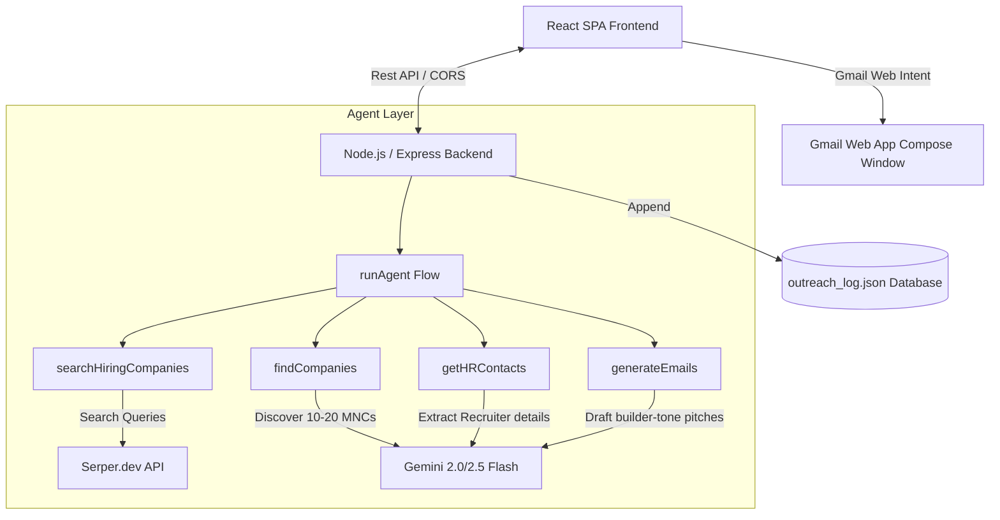

# 🤖 AI Outreach Agent (Job Hunter Edition)

> **"Built an AI agent that automates job outreach end-to-end"**
> A modern, premium cold outreach CRM & discovery engine tailored for GenAI aspirants, students, and early-career engineers to land roles at startups and MNCs through automated, personalized outreach.

---

## 🎯 The Problem

1. **Mass Applying is Broken:** Sending 100+ generic resumes via job boards results in a <1% response rate.
2. **Cold Emailing is Tedious:** Finding target companies, identifying correct HR emails, researching their engineering stack, and writing custom "builder-not-applicant" emails manually takes hours.
3. **Tracking is Chaos:** Managing spreadsheet columns for contact status, dates, and drafts leads to context fragmentation and UI sync issues.

## 💡 The Solution

An **intelligent agent pipeline** that automates the entire process in under 15 seconds:
* **Discover:** Scans the live web (via Serper) for companies hiring for your target role.
* **Enrich:** Generates HR contacts with realistic emails, confidence levels, and recruiter LinkedIn profiles.
* **Tailor:** Crafts hyper-personalized cold outreach emails using your specific profile (projects, skills, college) with a "builder tone" that stands out.
* **Track:** A built-in Single Source of Truth (SSoT) CRM dashboard to manage application statuses, edit drafts, and log outcomes.
* **Execute:** Opens Gmail compose with 1-click web intents (no complex OAuth setup required) and automatically logs activity.

---

## 🧱 System Architecture



---

## ⚙️ Core Folder Structure

```
linkedin/
 ├── frontend/               # React / Vite Client SPA
 │    ├── public/
 │    ├── src/
 │    │    ├── App.jsx       # Main Dashboard UI & Client State (SSoT)
 │    │    ├── index.css     # Premium Glassmorphic Design System
 │    │    └── main.jsx
 │    └── index.html
 ├── backend/                # Node.js / Express Server
 │    ├── routes/
 │    │    └── api.js        # API endpoints (/generate, /regenerate, /log-attempt)
 │    ├── services/
 │    │    ├── llm.js        # Gemini agent flow steps
 │    │    ├── search.js     # Serper search integrations
 │    │    └── email.js      # Gmail formatting & logging
 │    ├── utils/
 │    │    └── parser.js     # Robust JSON & fallback parsing
 │    └── index.js           # Server Entrypoint
 ├── outreach_log.json       # Local activity tracking logs (generated)
 ├── package.json            # Workspace orchestration
 └── README.md
```

---

## 🚀 Local Installation & Execution

### 1. Clone & Setup Workspace
In the workspace root directory, run:
```bash
# Install dependencies for both frontend and backend
npm run install:all
```

### 2. Configure Environment Variables
Create a `.env` file in the `backend/` directory:
```env
PORT=5001
GEMINI_API_KEY=your_gemini_api_key_here
SERPER_API_KEY=your_serper_api_key_here
```
*(Note: You can also input or override these keys directly in the frontend UI Settings tab).*

### 3. Run Development Servers
Launch both servers simultaneously using:
```bash
npm run dev
```
* **Frontend UI:** `http://localhost:5173`
* **Backend API:** `http://localhost:5001`

---

## ⚠️ Edge Case Protection (How it stands out)

* **🔴 Garbage JSON Handling:** If Gemini's JSON generator returns truncated brackets or Markdown tags, the server applies a custom regex-based `fallbackParser` in `utils/parser.js` to extract fields.
* **🔴 Missing Recruiter Emails:** If an HR contact is generated without an email address, their status is automatically marked as `invalid_contact` to prevent useless triggers.
* **🔴 Duplicate Company Filtering:** Implements a strict `Set` check to filter out redundant company profiles during the search discovery step.
* **🔴 Same-Email Recruiter Fatigue:** Prompts Gemini explicitly with the specific HR recruiter's name, company culture, and user's projects so every generated email body is custom-made.
* **🔴 Spam Mitigation:** The outreach is manual-trigger based—opening a Gmail compose tab individually instead of bulk emailing. This keeps you safe from spam filters while maintaining high deliverability.
* **🔴 Single Source of Truth:** The frontend UI uses the `HR Recruiter Contact` as the single source of truth. Status updates, notes, and edited drafts reside in a unified object to prevent state-sync bugs.

---

## 🌍 Production Deployment

### Backend (Render / Railway)
1. Link your GitHub repository.
2. Set root directory to `backend/` or build from root.
3. Add environment variables: `GEMINI_API_KEY` and `SERPER_API_KEY`.
4. Start command: `npm start`.

### Frontend (Vercel)
1. Set the build command to `npm run build` in the `frontend` folder.
2. Set output directory to `dist`.
3. In `App.jsx`, API endpoints dynamically adjust based on hostname, resolving to `/api` (same-origin relative request) to prevent CORS.
